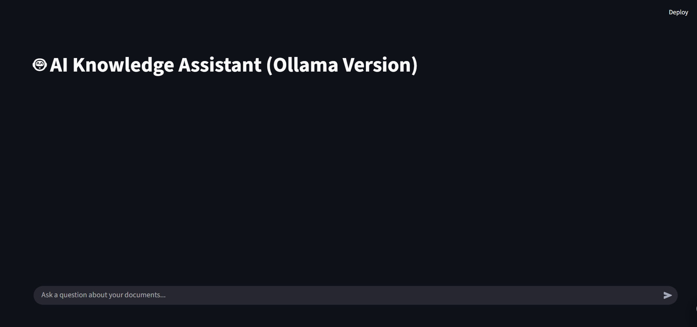

# AI-Powered Conversational Knowledge Assistant

This project is a high-performance, locally-run conversational assistant that allows users to ask natural language questions about a private knowledge base of Confluence documents. It is built using a modern Retrieval-Augmented Generation (RAG) architecture to provide accurate, fast, and secure answers.

 


## The Problem
Enterprise knowledge bases, like Confluence, often become vast and difficult to search using traditional keyword methods. This project was initiated to solve that problem by creating a system that understands a user's *intent* and provides direct, synthesized answers instead of just a list of links.

## Features
- **Conversational Interface:** Chat with your documents using a user-friendly Streamlit application with a persistent session history.
- **High-Quality Answers:** Utilizes a state-of-the-art RAG pipeline with a top-tier embedding model (`nomic-embed-text`) for superior retrieval accuracy.
- **Fast & Performant:** Leverages local GPU acceleration via an Ollama server to run the `Mistral-7B` LLM, providing near-instant answer generation.
- **Private & Secure:** All models and data are processed locally. No information is ever sent to external APIs.

## Technology Stack
- **Application & UI:** Python, Streamlit
- **AI Model Serving:** Ollama
- **Vector Database:** ChromaDB
- **Text Processing:** LangChain, BeautifulSoup4
- **Containerization (Planned):** Docker, Docker Compose

---

## Project Structure
```
.
├── prototyping/
│   └── Internship.ipynb      # The original Google Colab notebook for research and initial prototyping.
├── data/                     # (Ignored by Git) Your source HTML documents go here.
├── chroma_db_ollama/         # (Ignored by Git) The generated vector database.
├── build_database_ollama.py  # The backend script to build the knowledge base.
├── app_ollama.py             # The main Streamlit application script.
├── requirements.txt          # Python dependencies.
├── .gitignore                # Specifies files and folders for Git to ignore.
└── README.md                 # This file.
```
**Note:** The `prototyping/` directory contains the initial proof-of-concept. The final, runnable application is composed of the Python scripts in the root directory.

---

## Getting Started

Follow these steps to set up and run the project on your local machine.

### Prerequisites
Before you begin, ensure you have the following installed:
1.  **Python 3.11+**
2.  **Ollama:** Must be installed and running. ([Download here](https://ollama.com/))
3.  **Git**

### Step 1: Clone the Repository & Set Up Environment
First, clone this repository and navigate into the project directory. It is highly recommended to use a Python virtual environment.

```bash
# Clone the repository
git clone https://github.com/YourUsername/ai-knowledge-assistant.git
cd ai-knowledge-assistant

# Create a virtual environment
python -m venv .venv

# Activate the environment
# On Windows:
.\.venv\Scripts\activate.bat
# On macOS/Linux:
# source .venv/bin/activate

# Install the required Python packages
pip install -r requirements.txt
```

### Step 2: Prepare the AI Models with Ollama
Make sure the Ollama application is running in the background. Then, pull the required AI models by running these commands in your terminal:

```bash
# Pull the embedding model
ollama pull nomic-embed-text

# Pull the generation model
ollama pull mistral
```

### Step 3: Add Your Data & Build the Knowledge Base
1.  Create a folder named `data` in the root of the project directory.
2.  Place all your exported Confluence `.html` files inside this `data` folder.
3.  Run the backend script to process your documents and build the ChromaDB vector database. This must be run once, or anytime your documents change.

```bash
python build_database_ollama.py```
This will create a `chroma_db_ollama` folder in your project directory.

### Step 4: Launch the Application
Once the database is built, you can launch the Streamlit application.

```bash
streamlit run app_ollama.py
```
Your browser should automatically open to the application's URL (usually `http://localhost:8501`). The AI Knowledge Assistant is now ready to use.

---
